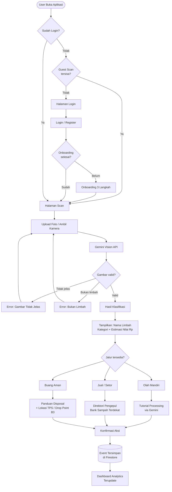
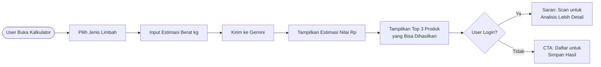
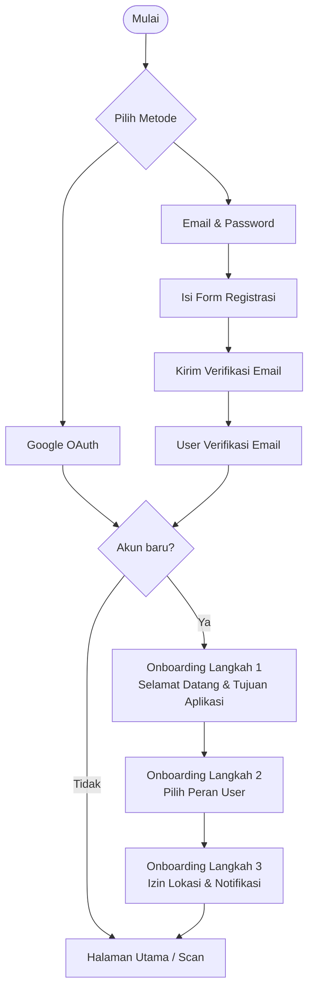
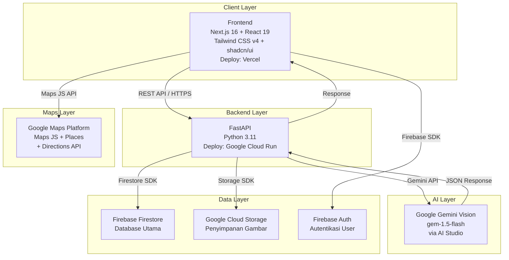
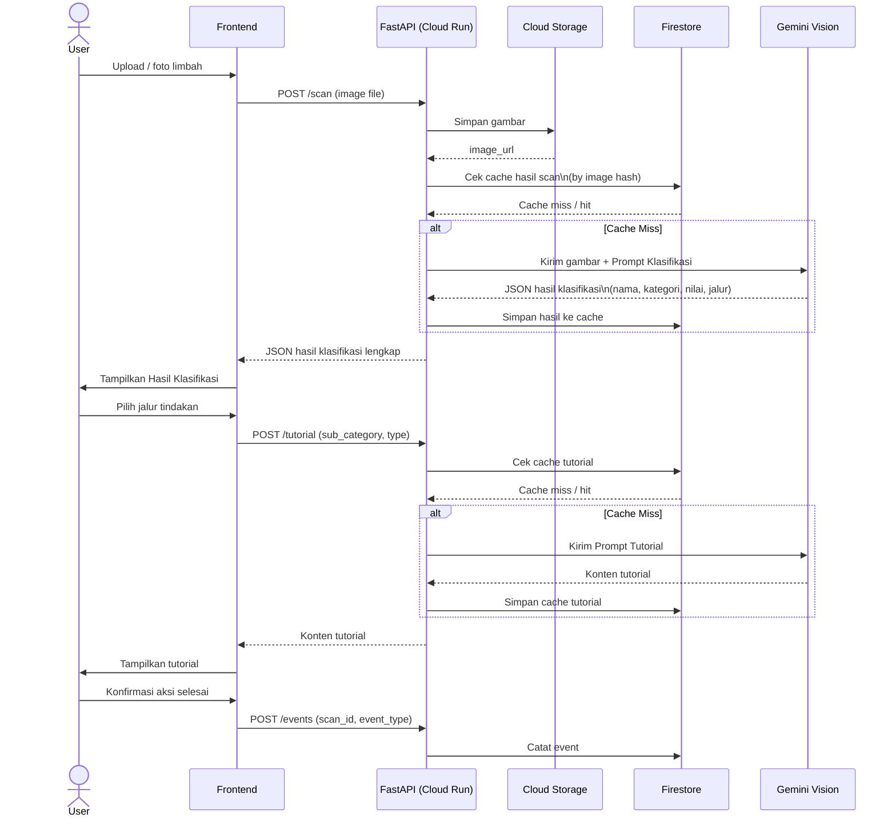
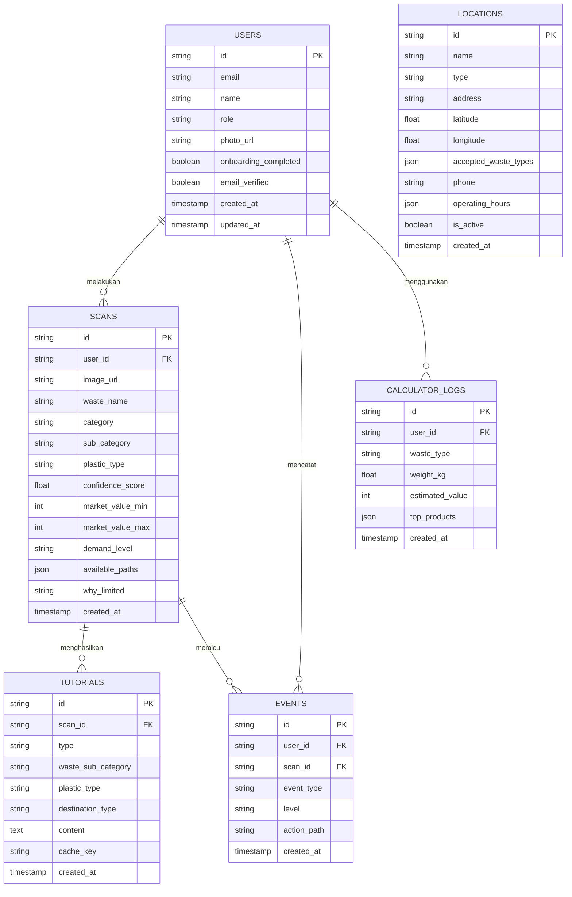

# Wastable: Overview & Konsep Produk

## Daftar Isi

1. [Ringkasan Eksekutif](#1-ringkasan-eksekutif)
2. [Latar Belakang & Problem Statement](#2-latar-belakang--problem-statement)
3. [Target User & Persona](#3-target-user--persona)
4. [Value Proposition](#4-value-proposition)
5. [Konsep Produk](#5-konsep-produk)
6. [Kategori Limbah](#6-kategori-limbah)
7. [Fitur Produk](#7-fitur-produk)
8. [Workflow Aplikasi](#8-workflow-aplikasi)
9. [Arsitektur Sistem](#9-arsitektur-sistem)
10. [Database Schema & ERD](#10-database-schema--erd)
11. [Inventory Screen](#11-inventory-screen)
12. [Metrik Keberhasilan](#12-metrik-keberhasilan)
13. [Out of Scope](#13-out-of-scope)
14. [Changelog](#14-changelog)

---

## 1. Ringkasan Eksekutif

Wastable adalah aplikasi web responsif berbasis AI yang membantu masyarakat Indonesia mengenali nilai ekonomi dari limbah yang mereka hasilkan dan membimbing mereka menuju tindakan yang paling tepat: mengolah sendiri menjadi produk bernilai, menjual ke pengepul atau Bank Sampah, atau membuang dengan cara yang aman dan bertanggung jawab.

Aplikasi ini menggunakan Gemini Vision API untuk mengklasifikasikan limbah dari foto, mengestimasi nilai pasarnya, dan menghasilkan panduan tindakan yang dinamis dan personal — bukan konten statis yang sama untuk semua orang.

**Platform:** Responsive Web App (bukan mobile native)  
**Bahasa antarmuka:** Bahasa Indonesia  
**AI Engine:** Google Gemini Vision (via Google AI Studio)  
**Deploy:** Cloud Run (backend) + Vercel (frontend)

---

## 2. Latar Belakang & Problem Statement

### Konteks

Indonesia menghasilkan lebih dari 68 juta ton sampah per tahun, namun tingkat daur ulang dan pengolahan limbah yang terkelola masih sangat rendah. Sebagian besar limbah yang berpotensi bernilai ekonomi — seperti plastik, logam, kertas, dan limbah organik — berakhir di tempat pembuangan akhir tanpa sempat diolah.

Di sisi lain, gerakan hilirisasi yang digaungkan pemerintah sebagian besar masih berputar di level industri besar. Hilirisasi di level rumah tangga dan UMKM hampir tidak tersentuh karena ketiadaan informasi, panduan, dan akses ke pembeli.

### Problem Statement

> Mayoritas masyarakat Indonesia tidak menyadari bahwa limbah yang mereka hasilkan memiliki nilai ekonomi. Bahkan jika mereka menyadarinya, mereka tidak tahu cara mengolahnya, tidak tahu berapa harganya, dan tidak tahu ke mana harus membawanya.

### Akar Masalah

| Masalah | Dampak |
|---|---|
| Tidak ada cara mudah untuk mengidentifikasi jenis limbah | Limbah dibuang sembarangan tanpa pilah |
| Tidak ada informasi nilai ekonomi limbah yang accessible | Peluang ekonomi hilang setiap hari |
| Tutorial pengolahan limbah tersebar dan tidak terstandar | Potensi produk bernilai tidak terealisasi |
| Lokasi pengepul dan Bank Sampah tidak mudah ditemukan | Limbah yang sudah dipilah pun tidak tersalurkan |
| Limbah B3 sering dibuang ke tempat sampah biasa | Risiko kesehatan dan lingkungan meningkat |

---

## 3. Target User & Persona

### Persona Utama (Versi 1)

**Penghasil Limbah**

Individu atau unit usaha kecil yang menghasilkan limbah dan ingin tahu nilai serta cara penanganannya.

| Atribut | Detail |
|---|---|
| Segmen | Rumah tangga, kos/kosan, warung, UMKM kecil |
| Usia | 18–45 tahun |
| Literasi digital | Menengah — terbiasa dengan aplikasi smartphone |
| Motivasi | Ingin tahu nilai limbahnya, ingin berkontribusi, atau sekadar penasaran |
| Pain point | Tidak tahu limbah punya nilai, tidak tahu harus ke mana, proses terasa ribet |

### Persona Pendukung (Data Direktori, Bukan User Aktif di V1)

**Pengrajin / UMKM Daur Ulang**

Pelaku usaha yang membutuhkan bahan baku dari limbah. Pada V1 hadir sebagai entri di direktori lokasi, bukan sebagai pengguna yang bisa login dan posting kebutuhan.

**Pengepul / Bank Sampah**

Penyedia layanan penerimaan limbah. Pada V1 hadir sebagai data lokasi yang dapat dicari dan difilter, dengan informasi jenis limbah yang diterima dan jam operasional.

---

## 4. Value Proposition

### Pernyataan Nilai

> Wastable mengubah cara pandang masyarakat terhadap limbah — dari sesuatu yang harus dibuang menjadi sumber daya yang bisa bernilai. Dengan satu foto, pengguna langsung tahu apa limbahnya, berapa estimasi nilainya, dan langkah paling tepat yang bisa diambil.

### Keunggulan Dibanding Alternatif

| Alternatif yang Ada | Kelemahan | Keunggulan Wastable |
|---|---|---|
| Artikel/blog daur ulang | Tidak personal, harus dicari manual | AI menganalisis limbah spesifik milik user |
| Aplikasi TPS konvensional | Hanya arahkan ke tempat buang, tidak ada nilai ekonomi | Tiga jalur tindakan dengan prioritas hilirisasi |
| Marketplace daur ulang | Butuh daftar, proses panjang, tidak ada panduan | Langsung dari scan ke panduan dalam satu flow |
| Komunitas daur ulang | Tidak scalable, tidak real-time | Panduan instan via Gemini, tersedia 24/7 |

---

## 5. Konsep Produk

### Tiga Jalur Tindakan

Setiap limbah yang discan akan dievaluasi AI dan diarahkan ke satu atau lebih dari tiga jalur tindakan. UI hanya menampilkan jalur yang relevan berdasarkan jenis limbah.

**Jalur 1 — Olah Mandiri (Hilirisasi Mandiri)**
Tutorial dinamis yang dihasilkan Gemini tentang cara mengubah limbah menjadi produk bernilai. Termasuk panduan langkah demi langkah, alat yang dibutuhkan, dan estimasi nilai produk yang dihasilkan.

**Jalur 2 — Jual / Setor (Hilirisasi via Pasar)**
Direktori pengepul dan Bank Sampah terdekat yang menerima jenis limbah tersebut, dilengkapi informasi harga beli, jam operasional, dan navigasi Google Maps.

**Jalur 3 — Buang Aman (Disposal Bertanggung Jawab)**
Fallback untuk limbah yang tidak dapat dihilirisasi — limbah dengan nilai pasar sangat rendah atau limbah B3 yang berbahaya. Berisi panduan cara membuang dengan benar dan lokasi TPS atau drop point B3 terdekat.

### Aturan Ketersediaan Jalur

| Kategori Limbah | Olah Mandiri | Jual / Setor | Buang Aman |
|---|---|---|---|
| Organik bersih | Tersedia | Terbatas | Fallback |
| Anorganik bersih (PET, kardus, logam) | Tersedia | Tersedia | Fallback |
| Anorganik kotor / terkontaminasi | Tidak | Terbatas | Tersedia |
| Styrofoam, popok, plastik campuran | Tidak | Tidak | Tersedia |
| B3 (baterai, cat, obat, merkuri) | Tidak | Tidak | Wajib |

---

## 6. Kategori Limbah

### Organik
- Food waste (sisa makanan, kulit buah, ampas kopi)
- Sampah kebun (daun, ranting, rumput)
- Kertas dan kardus
- Kayu

### Anorganik
- Plastik: PET, HDPE, PP, PVC, LDPE, PS
- Logam: besi, aluminium, tembaga
- Kaca
- Elektronik (e-waste)
- Karet

### B3 (Bahan Berbahaya dan Beracun)
- Baterai (AA, AAA, lithium)
- Cat dan pelarut kimia
- Obat dan suplemen kadaluarsa
- Lampu merkuri dan neon
- Limbah medis rumah tangga (jarum suntik, perban bekas)

---

## 7. Fitur Produk

### Fitur Inti

**AI Scan dan Klasifikasi Limbah**
User memotret atau mengunggah gambar limbah. Gemini Vision mengidentifikasi jenis limbah, kategori, sub-kategori, confidence score, estimasi nilai pasar, dan jalur tindakan yang tersedia.

**Estimasi Nilai Ekonomi**
Setiap hasil scan menyertakan estimasi harga pasar per kilogram berdasarkan data nasional. Ditampilkan sebagai informasi edukatif, bukan harga real-time dari sistem marketplace.

**Tutorial Dinamis (Gemini-generated)**
Tiga tipe tutorial yang sepenuhnya dihasilkan Gemini berdasarkan jenis limbah spesifik:
- Processing: cara mengolah menjadi produk bernilai
- Preparation: cara membersihkan dan mengemas sebelum disetor
- On-Location: prosedur yang perlu dilakukan saat tiba di lokasi penerima

**Direktori Lokasi**
Peta interaktif berisi pengepul, Bank Sampah, TPS, dan drop point B3. Dapat difilter berdasarkan jenis limbah yang diterima. Terintegrasi dengan Google Maps untuk navigasi.

**Kalkulator Nilai Limbah**
Fitur mandiri tanpa perlu scan — user input jenis limbah dan estimasi berat, langsung mendapat estimasi nilai dalam Rupiah dan potensi produk yang bisa dihasilkan. Tersedia di landing page sebagai live demo.

### Fitur Pendukung

| Fitur | Deskripsi |
|---|---|
| Guest Access | 2x scan tanpa login, hasil tidak tersimpan |
| Autentikasi | Google OAuth dan Email & Password via Firebase Auth |
| Onboarding | 3 langkah setelah registrasi pertama, termasuk pemilihan peran user |
| Riwayat Scan | Daftar scan yang tersimpan beserta statistik personal |
| Dashboard Analytics | Ringkasan dampak ekonomi dan lingkungan dari aktivitas user |
| Profil User | Manajemen akun dan ringkasan total dampak |

---

## 8. Workflow Aplikasi

### Alur Utama: Core Scan Flow

### Alur Kalkulator Nilai Limbah

### Alur Autentikasi & Onboarding

---

## 9. Arsitektur Sistem

### Diagram Arsitektur

### Sequence Diagram: Proses Scan

---

## 10. Database Schema & ERD

### Entity Relationship Diagram

### Spesifikasi Koleksi Firestore

#### Koleksi: `users`

| Field | Tipe | Keterangan |
|---|---|---|
| id | string | UID dari Firebase Auth |
| email | string | Email user |
| name | string | Nama lengkap |
| role | string | `penghasil` / `pengrajin` / `pengepul` |
| photo_url | string | URL foto profil (nullable) |
| onboarding_completed | boolean | Status onboarding |
| email_verified | boolean | Status verifikasi email |
| created_at | timestamp | Waktu registrasi |
| updated_at | timestamp | Waktu pembaruan terakhir |

#### Koleksi: `scans`

| Field | Tipe | Keterangan |
|---|---|---|
| id | string | Auto-generated ID |
| user_id | string | Referensi ke `users.id` (nullable untuk guest) |
| image_url | string | URL gambar di Cloud Storage |
| waste_name | string | Nama limbah hasil klasifikasi |
| category | string | `organik` / `anorganik` / `b3` |
| sub_category | string | Sub-kategori spesifik (misal: `plastik_pet`) |
| plastic_type | string | Kode plastik jika berlaku (nullable) |
| confidence_score | float | Nilai keyakinan AI (0.0–1.0) |
| market_value_min | int | Estimasi harga minimum per kg (Rupiah) |
| market_value_max | int | Estimasi harga maksimum per kg (Rupiah) |
| demand_level | string | `tinggi` / `sedang` / `rendah` |
| available_paths | json | `{transform: bool, sell: bool, safe_disposal: bool}` |
| why_limited | string | Penjelasan jika jalur terbatas (nullable) |
| created_at | timestamp | Waktu scan |

#### Koleksi: `tutorials`

| Field | Tipe | Keterangan |
|---|---|---|
| id | string | Auto-generated ID |
| scan_id | string | Referensi ke `scans.id` |
| type | string | `processing` / `preparation` / `on_location` |
| waste_sub_category | string | Sub-kategori sebagai bagian cache key |
| plastic_type | string | Tipe plastik jika berlaku (nullable) |
| destination_type | string | `bank_sampah` / `pengepul` / `tps` / `drop_point_b3` |
| content | text | Konten tutorial dari Gemini (Markdown) |
| cache_key | string | Format: `{sub_category}_{plastic_type}_{type}_{destination}` |
| created_at | timestamp | Waktu generate |

#### Koleksi: `locations`

| Field | Tipe | Keterangan |
|---|---|---|
| id | string | Auto-generated ID |
| name | string | Nama lokasi |
| type | string | `tps` / `bank_sampah` / `pengepul` / `drop_point_b3` |
| address | string | Alamat lengkap |
| latitude | float | Koordinat latitude |
| longitude | float | Koordinat longitude |
| accepted_waste_types | array | Daftar sub-kategori yang diterima |
| phone | string | Nomor kontak (nullable) |
| operating_hours | json | `{open: "08:00", close: "17:00", days: [...]}` |
| is_active | boolean | Status aktif lokasi |
| created_at | timestamp | Waktu data ditambahkan |

#### Koleksi: `events`

| Field | Tipe | Keterangan |
|---|---|---|
| id | string | Auto-generated ID |
| user_id | string | Referensi ke `users.id` |
| scan_id | string | Referensi ke `scans.id` |
| event_type | string | Lihat tabel event types di bawah |
| level | string | `estimated` / `confirmed` |
| action_path | string | `transform` / `sell` / `safe_disposal` |
| created_at | timestamp | Waktu event |

**Tipe Event:**

| Event Type | Level | Trigger |
|---|---|---|
| `scan_completed` | — | Hasil klasifikasi berhasil ditampilkan |
| `path_selected` | — | User memilih salah satu jalur tindakan |
| `tutorial_opened` | — | User membuka halaman tutorial |
| `tutorial_completed` | estimated | User menyelesaikan baca tutorial |
| `navigation_started` | estimated | User tap tombol Rute ke lokasi |
| `action_confirmed` | confirmed | User tap konfirmasi "Sudah Dilakukan" |

#### Koleksi: `calculator_logs`

| Field | Tipe | Keterangan |
|---|---|---|
| id | string | Auto-generated ID |
| user_id | string | Referensi ke `users.id` (nullable) |
| waste_type | string | Jenis limbah yang diinput |
| weight_kg | float | Berat estimasi dalam kg |
| estimated_value | int | Hasil estimasi nilai dalam Rupiah |
| top_products | json | Array 3 produk potensial dari Gemini |
| created_at | timestamp | Waktu kalkulasi |

---

## 11. Inventory Screen

| No | Nama Screen | Status | Perubahan dari Konsep Lama |
|---|---|---|---|
| 01 | Landing Page | Modifikasi | Tambah Kalkulator Nilai sebagai live demo |
| 02 | Register | Tetap | — |
| 03 | Login | Tetap | — |
| 04 | Verify Email | Tetap | — |
| 05 | Onboarding | Modifikasi | Tambah langkah pilih peran user |
| 06 | Scan Page | Tetap | — |
| 07 | Hasil Klasifikasi | Modifikasi | Tambah estimasi nilai Rp, 3 jalur tindakan |
| 08 | Tutorial Detail | Modifikasi | Reframe output ke nilai produk yang dihasilkan |
| 09 | Direktori Lokasi | Modifikasi | Diperluas ke pengepul dan drop point B3 |
| 10 | Kalkulator Nilai | Baru | Input manual, estimasi Rp, top 3 produk |
| 11 | Riwayat Scan | Tetap | — |
| 12 | Dashboard Analytics | Modifikasi | Fokus ke economic impact (Rp), bukan hanya CO2 |
| 13 | Profil User | Tetap | — |
| 14 | Error States | Modifikasi | Tambah state khusus deteksi B3 |

---

## 12. Metrik Keberhasilan

### Metrik Produk

| Metrik | Definisi | Target Awal |
|---|---|---|
| Scan completion rate | % scan yang berhasil terklasifikasi | > 85% |
| Path selection rate | % user yang memilih jalur setelah scan | > 70% |
| Tutorial completion rate | % user yang menyelesaikan tutorial | > 50% |
| Confirmation rate | % event yang mencapai level `confirmed` | > 20% |
| Return rate | % user yang kembali scan dalam 7 hari | > 30% |

### Metrik Dampak (Dashboard)

| Metrik | Cara Hitung |
|---|---|
| Total nilai limbah teridentifikasi | Jumlah `market_value_avg` dari semua scan |
| Total nilai terealisasi (estimated) | Dari event level `estimated` |
| Total nilai terealisasi (confirmed) | Dari event level `confirmed` |
| Komposisi limbah | Breakdown kategori dari seluruh scan |
| Kota dengan aktivitas tertinggi | Agregat lokasi user berdasarkan lokasi scan |

---

## 13. Out of Scope (Versi 1)

Fitur-fitur berikut tidak termasuk dalam versi pertama dan dapat dipertimbangkan untuk iterasi selanjutnya:

- Marketplace aktif dengan fitur posting penawaran dan permintaan limbah secara real-time
- Login dan dashboard terpisah untuk persona Pengrajin dan Pengepul
- Sistem rating dan review untuk lokasi penerima limbah
- Integrasi pembayaran atau pencairan nilai limbah
- Notifikasi push berbasis lokasi
- Fitur komunitas atau forum diskusi antar pengguna
- Dukungan multi-bahasa (Inggris, bahasa daerah)
- Aplikasi mobile native (iOS / Android)

---

## 14. Changelog

| Versi | Tanggal | Perubahan |
|---|---|---|
| 1.0.0 | 2025 | Dokumen awal — pivot dari Waste AI ke Wastable dengan konsep hilirisasi limbah |
