# Software Requirements Specification (SRS)
# Wastable — Platform Hilirisasi Limbah Berbasis AI

## Daftar Isi

1. [Pendahuluan](#1-pendahuluan)
2. [Gambaran Umum Sistem](#2-gambaran-umum-sistem)
3. [Kebutuhan Fungsional](#3-kebutuhan-fungsional)
4. [Kebutuhan Non-Fungsional](#4-kebutuhan-non-fungsional)
5. [Arsitektur Sistem](#5-arsitektur-sistem)
6. [Tech Stack](#6-tech-stack)
7. [Infrastruktur Frontend](#7-infrastruktur-frontend)
8. [Infrastruktur Backend](#8-infrastruktur-backend)
9. [Infrastruktur AI](#9-infrastruktur-ai)
10. [Infrastruktur Database & Storage](#10-infrastruktur-database--storage)
11. [Infrastruktur Autentikasi](#11-infrastruktur-autentikasi)
12. [Infrastruktur Maps](#12-infrastruktur-maps)
13. [Arsitektur Deployment](#13-arsitektur-deployment)
14. [Alur Kerja Aplikasi](#14-alur-kerja-aplikasi)
15. [Spesifikasi API](#15-spesifikasi-api)
16. [Strategi Keamanan](#16-strategi-keamanan)
17. [Penanganan Error](#17-penanganan-error)
18. [Batasan & Risiko](#18-batasan--risiko)
19. [Glosarium](#19-glosarium)

---

## 1. Pendahuluan

### 1.1 Tujuan Dokumen

Dokumen ini merupakan Software Requirements Specification (SRS) untuk aplikasi Wastable. SRS ini mendeskripsikan keseluruhan arsitektur, infrastruktur, tech stack, dan alur kerja aplikasi secara menyeluruh dan dapat dijadikan pegangan utama selama proses implementasi oleh seluruh anggota tim.

### 1.2 Ruang Lingkup

Wastable adalah platform web responsif yang memungkinkan pengguna untuk mengidentifikasi limbah melalui foto, mengetahui nilai ekonominya, dan mendapatkan panduan tindakan yang paling tepat — mengolah sendiri, menjual ke pengepul, atau membuang dengan aman. Sistem ini memanfaatkan Google Gemini Vision API sebagai engine AI utama dan beroperasi di atas infrastruktur Google Cloud Platform.

### 1.3 Definisi dan Akronim

| Istilah | Definisi |
|---|---|
| SRS | Software Requirements Specification |
| API | Application Programming Interface |
| REST | Representational State Transfer |
| GCP | Google Cloud Platform |
| CDN | Content Delivery Network |
| SSR | Server-Side Rendering |
| CSR | Client-Side Rendering |
| JWT | JSON Web Token |
| B3 | Bahan Berbahaya dan Beracun |
| TPS | Tempat Pembuangan Sementara |
| ERD | Entity Relationship Diagram |
| CI/CD | Continuous Integration / Continuous Deployment |
| ORM | Object Relational Mapper |

### 1.4 Asumsi dan Dependensi

- Pengguna memiliki akses internet yang stabil saat menggunakan aplikasi
- Perangkat pengguna mendukung kamera (untuk fitur scan via mobile)
- Google Gemini Vision API tersedia dan memiliki kuota yang cukup
- Firebase project sudah dikonfigurasi dengan Firestore, Auth, dan Cloud Storage aktif
- Google Maps Platform sudah diaktifkan dengan billing yang sesuai
- Cloud Run tersedia di region yang ditargetkan (asia-southeast2 / Jakarta)

---

## 2. Gambaran Umum Sistem

### 2.1 Deskripsi Produk

Wastable adalah sistem client-server berbasis web yang terdiri dari:

- **Frontend**: Antarmuka pengguna berbasis React yang di-deploy ke Vercel
- **Backend**: REST API berbasis FastAPI yang di-deploy ke Google Cloud Run
- **AI Engine**: Google Gemini Vision yang diakses melalui Google AI Studio API
- **Database**: Firebase Firestore sebagai database utama
- **Storage**: Google Cloud Storage untuk penyimpanan gambar limbah
- **Auth**: Firebase Authentication untuk manajemen sesi pengguna
- **Maps**: Google Maps Platform untuk fitur lokasi dan navigasi

### 2.2 Konteks Sistem

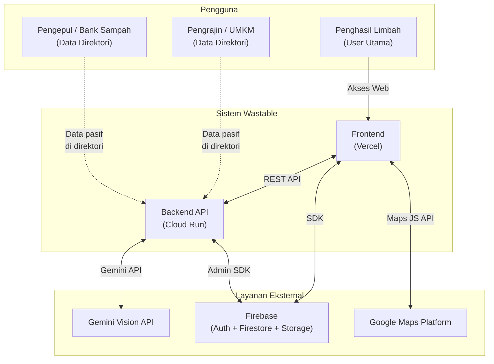

### 2.3 Batasan Sistem

- Sistem tidak memiliki fitur marketplace aktif (transaksi jual beli real-time)
- Estimasi nilai ekonomi bersifat informatif, bukan harga real-time dari pasar
- Data lokasi pengepul dan Bank Sampah dikelola secara manual (kurasi tim), bukan crowdsourced di V1
- Sistem hanya tersedia dalam Bahasa Indonesia di V1

---

## 3. Kebutuhan Fungsional

### 3.1 Manajemen Pengguna

| ID | Kebutuhan |
|---|---|
| FR-01 | Sistem menyediakan registrasi via Google OAuth |
| FR-02 | Sistem menyediakan registrasi via Email dan Password |
| FR-03 | Sistem mengirimkan verifikasi email setelah registrasi |
| FR-04 | Sistem menampilkan alur onboarding 3 langkah setelah registrasi pertama |
| FR-05 | Sistem memungkinkan pemilihan peran user saat onboarding (penghasil / pengrajin / pengepul) |
| FR-06 | Sistem menyediakan akses tamu (guest) dengan batas 2x scan tanpa login |
| FR-07 | Sistem menyimpan profil pengguna dan total dampak yang terakumulasi |

### 3.2 AI Scan dan Klasifikasi

| ID | Kebutuhan |
|---|---|
| FR-08 | Sistem menerima input gambar melalui upload file atau kamera (mobile) |
| FR-09 | Sistem memvalidasi bahwa gambar mengandung objek limbah sebelum diproses |
| FR-10 | Sistem mengklasifikasikan limbah ke dalam kategori, sub-kategori, dan tipe spesifik |
| FR-11 | Sistem menampilkan confidence score dari hasil klasifikasi |
| FR-12 | Sistem menampilkan estimasi nilai pasar per kg dalam Rupiah |
| FR-13 | Sistem menentukan jalur tindakan yang tersedia (transform / sell / safe_disposal) |
| FR-14 | Sistem menjelaskan alasan pembatasan jalur untuk limbah tertentu |
| FR-15 | Sistem menggunakan mekanisme caching untuk menghindari pemrosesan duplikat |

### 3.3 Tiga Jalur Tindakan

| ID | Kebutuhan |
|---|---|
| FR-16 | Sistem menghasilkan tutorial pengolahan (processing) secara dinamis via Gemini |
| FR-17 | Sistem menghasilkan panduan persiapan (preparation) sebelum ke lokasi |
| FR-18 | Sistem menghasilkan panduan on-location saat tiba di lokasi penerima |
| FR-19 | Sistem menampilkan direktori lokasi pengepul dan Bank Sampah yang relevan |
| FR-20 | Sistem menampilkan lokasi TPS dan drop point B3 untuk jalur buang aman |
| FR-21 | Sistem menyediakan navigasi Google Maps ke lokasi yang dipilih |

### 3.4 Kalkulator Nilai Limbah

| ID | Kebutuhan |
|---|---|
| FR-22 | Sistem menyediakan kalkulator nilai limbah yang dapat diakses tanpa scan |
| FR-23 | Kalkulator menerima input jenis limbah dan estimasi berat dalam kg |
| FR-24 | Kalkulator menghasilkan estimasi nilai dalam Rupiah dan top 3 produk potensial |
| FR-25 | Kalkulator dapat diakses oleh pengguna yang belum login |

### 3.5 Event Tracking dan Analytics

| ID | Kebutuhan |
|---|---|
| FR-26 | Sistem mencatat 6 jenis event dari aktivitas pengguna |
| FR-27 | Sistem membedakan dua level konfirmasi: estimated dan confirmed |
| FR-28 | Dashboard menampilkan dampak ekonomi personal pengguna |
| FR-29 | Dashboard menampilkan komposisi jenis limbah yang pernah discan |
| FR-30 | Dashboard menampilkan perbandingan data estimated vs confirmed secara terpisah |

---

## 4. Kebutuhan Non-Fungsional

### 4.1 Performa

| Parameter | Target |
|---|---|
| Waktu respons API klasifikasi | < 5 detik (tanpa cache) |
| Waktu respons API klasifikasi | < 1 detik (dengan cache) |
| Waktu muat halaman pertama (LCP) | < 2.5 detik |
| Ukuran bundle JavaScript frontend | < 300 KB (gzip) |
| Uptime layanan backend | > 99.5% |

### 4.2 Skalabilitas

- Backend (Cloud Run) dikonfigurasi dengan auto-scaling berdasarkan jumlah request
- Minimum instance: 0 (scale to zero saat tidak ada traffic)
- Maximum instance: 10 (dapat disesuaikan)
- Firestore berskala otomatis tanpa konfigurasi manual

### 4.3 Keamanan

- Semua komunikasi menggunakan HTTPS/TLS
- API key Gemini tidak pernah dikirim ke client
- Firebase ID Token divalidasi di setiap request yang membutuhkan autentikasi
- Gambar yang diupload divalidasi tipe dan ukurannya sebelum disimpan
- CORS dikonfigurasi hanya untuk domain frontend yang terdaftar

### 4.4 Kompatibilitas

- Browser: Chrome, Firefox, Safari, Edge (versi terbaru)
- Mobile: Android Chrome, iOS Safari
- Resolusi layar: 320px hingga 1920px (responsive)

### 4.5 Aksesibilitas

- Kontras warna memenuhi standar WCAG 2.1 AA
- Semua elemen interaktif dapat diakses via keyboard
- Atribut ARIA tersedia pada komponen utama

---

## 5. Arsitektur Sistem

### 5.1 Pola Arsitektur

Wastable menggunakan pola **Layered Architecture** dengan pemisahan yang jelas antara lapisan presentasi, logika bisnis, dan data. Backend mengadopsi pola **Clean Architecture** dengan dependency yang selalu mengarah ke dalam (dari detail ke domain).

### 5.2 Diagram Arsitektur Lengkap

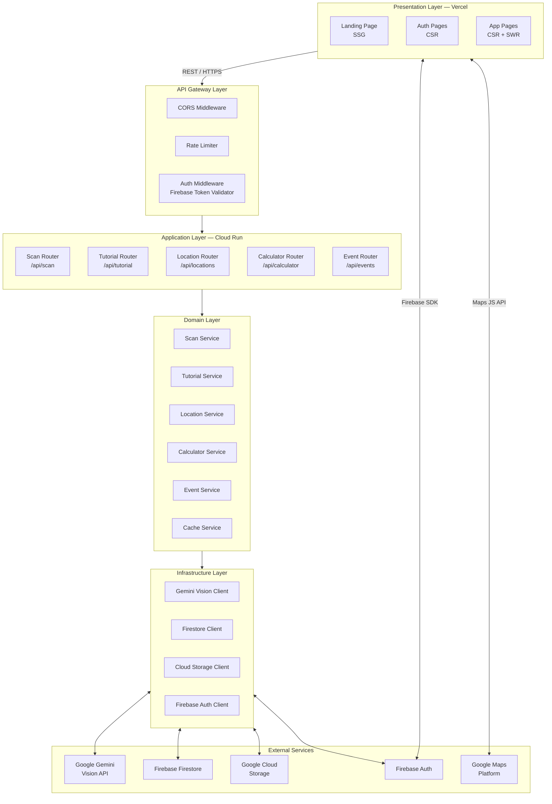

### 5.3 Prinsip Arsitektur

**Separation of Concerns**: Setiap lapisan memiliki tanggung jawab yang jelas dan tidak saling menembus. Frontend tidak berkomunikasi langsung ke Gemini API — semua request AI melewati backend.

**Cache First**: Setiap hasil klasifikasi dan tutorial dicache di Firestore menggunakan cache key yang deterministik. Request kedua untuk jenis limbah yang sama akan dilayani dari cache tanpa memanggil Gemini.

**Graceful Degradation**: Jika satu layanan eksternal tidak tersedia (misalnya Maps API), fitur lain tetap berfungsi. Error tidak boleh mematikan seluruh aplikasi.

**Stateless Backend**: Setiap request ke backend bersifat independen. State pengguna disimpan di Firestore dan Firebase Auth, bukan di memori server.

---

## 6. Tech Stack

### 6.1 Ringkasan Stack

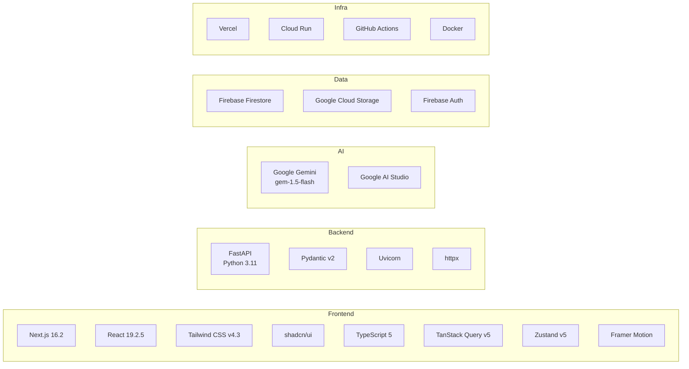

### 6.2 Justifikasi Pemilihan Stack

| Komponen | Pilihan | Alasan |
|---|---|---|
| Frontend Framework | Next.js 16 | SSG untuk halaman publik, CSR untuk app, ekosistem React matang |
| CSS Framework | Tailwind CSS v4 | Utility-first, performa tinggi, konfigurasi minimal |
| Component Library | shadcn/ui | Komponen accessible, dapat dikustomisasi penuh, tidak menambah runtime bundle |
| State Management | Zustand v5 | Minimal boilerplate, performa tinggi untuk global state sederhana |
| Server State | TanStack Query v5 | Caching, invalidation, dan sinkronisasi server state yang robust |
| Backend Framework | FastAPI | Async native, auto-generated OpenAPI docs, validasi Pydantic built-in |
| AI Model | Gemini 1.5 Flash | Kemampuan vision, kecepatan respons tinggi, biaya per token rendah |
| Database | Firebase Firestore | Realtime, NoSQL fleksibel, SDK tersedia di client dan server |
| Deploy Frontend | Vercel | Integrasi native Next.js, CDN global, preview deployment otomatis |
| Deploy Backend | Cloud Run | Serverless, auto-scaling, sesuai syarat lomba |

---

## 7. Infrastruktur Frontend

### 7.1 Struktur Direktori Proyek

```
hilarai-frontend/
├── app/                        # Next.js App Router
│   ├── (public)/               # Route group: halaman publik
│   │   ├── page.tsx            # Landing Page
│   │   ├── login/page.tsx
│   │   ├── register/page.tsx
│   │   └── verify-email/page.tsx
│   ├── (auth)/                 # Route group: halaman yang butuh login
│   │   ├── layout.tsx          # Layout dengan auth guard
│   │   ├── scan/page.tsx
│   │   ├── result/[scanId]/page.tsx
│   │   ├── tutorial/page.tsx
│   │   ├── locations/page.tsx
│   │   ├── calculator/page.tsx
│   │   ├── history/page.tsx
│   │   ├── dashboard/page.tsx
│   │   └── profile/page.tsx
│   ├── onboarding/page.tsx
│   ├── layout.tsx              # Root layout
│   └── globals.css
├── components/
│   ├── ui/                     # shadcn/ui components
│   ├── common/                 # Shared components
│   ├── scan/                   # Komponen scan flow
│   ├── result/                 # Komponen hasil klasifikasi
│   ├── tutorial/               # Komponen tutorial
│   ├── locations/              # Komponen peta dan direktori
│   ├── calculator/             # Komponen kalkulator
│   └── dashboard/              # Komponen analytics
├── lib/
│   ├── api/                    # API client functions
│   ├── firebase/               # Firebase config dan helpers
│   ├── hooks/                  # Custom React hooks
│   ├── stores/                 # Zustand stores
│   ├── types/                  # TypeScript type definitions
│   └── utils/                  # Utility functions
├── public/                     # Static assets
├── next.config.ts
├── tailwind.config.ts
└── tsconfig.json
```

### 7.2 Rendering Strategy

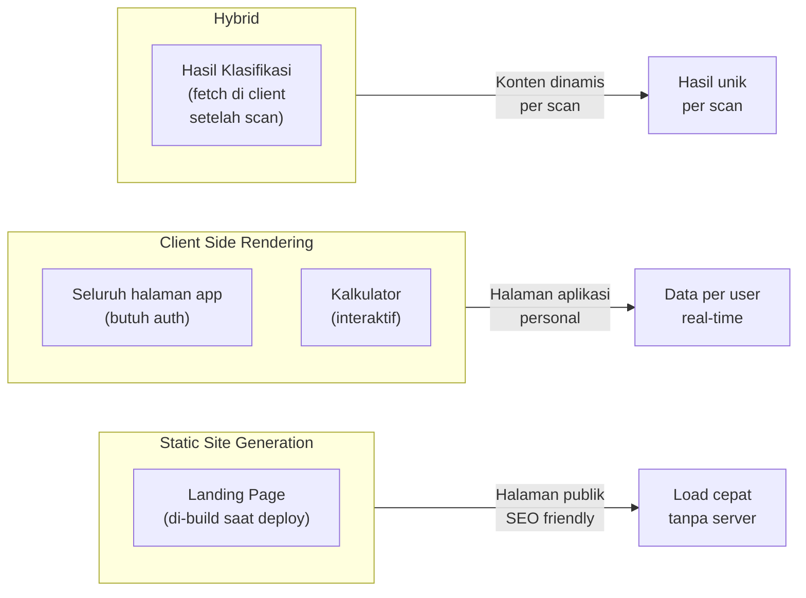

### 7.3 State Management

| Jenis State | Tool | Keterangan |
|---|---|---|
| Auth state (user, session) | Zustand + Firebase SDK | Persisten, di-sync dengan Firebase Auth |
| Server state (data API) | TanStack Query | Caching otomatis, background refetch |
| UI state (modal, sidebar) | React useState lokal | Tidak perlu global state |
| Form state | React useState / uncontrolled | Form scan dan kalkulator |

### 7.4 Arsitektur Komponen

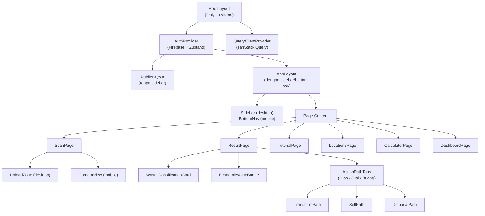

### 7.5 Pola Komunikasi API

Seluruh request ke backend menggunakan fungsi terpusat di `lib/api/` yang menambahkan Firebase ID Token secara otomatis:

```
Request Flow:
Component → useQuery/useMutation (TanStack Query)
          → api client function (lib/api/)
          → tambah Authorization header (Firebase ID Token)
          → fetch ke Backend API
          → response di-cache oleh TanStack Query
          → komponen re-render dengan data baru
```

### 7.6 Navigasi

| Breakpoint | Navigasi | Item |
|---|---|---|
| Desktop (>= 1024px) | Sidebar kiri fixed 240px | Scan, Lokasi, Kalkulator, Riwayat, Dashboard, Profil |
| Mobile (< 1024px) | Bottom navigation bar | Scan, Lokasi, Kalkulator, Profil |

---

## 8. Infrastruktur Backend

### 8.1 Struktur Direktori Proyek

```
hilarai-backend/
├── app/
│   ├── main.py                 # Entry point FastAPI
│   ├── config.py               # Konfigurasi lingkungan (env vars)
│   ├── routers/                # Route handlers per domain
│   │   ├── scan.py
│   │   ├── tutorial.py
│   │   ├── locations.py
│   │   ├── calculator.py
│   │   └── events.py
│   ├── services/               # Business logic layer
│   │   ├── scan_service.py
│   │   ├── tutorial_service.py
│   │   ├── location_service.py
│   │   ├── calculator_service.py
│   │   ├── event_service.py
│   │   └── cache_service.py
│   ├── models/                 # Pydantic schemas (request & response)
│   │   ├── scan.py
│   │   ├── tutorial.py
│   │   ├── location.py
│   │   ├── calculator.py
│   │   └── event.py
│   ├── infrastructure/         # Klien ke layanan eksternal
│   │   ├── gemini_client.py
│   │   ├── firestore_client.py
│   │   ├── storage_client.py
│   │   └── firebase_auth.py
│   └── middleware/
│       ├── auth_middleware.py  # Validasi Firebase ID Token
│       ├── cors_middleware.py
│       └── rate_limit.py
├── Dockerfile
├── requirements.txt
└── .env.example
```

### 8.2 Layer Arsitektur Backend

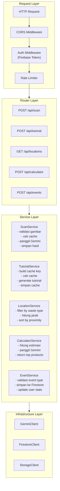

### 8.3 Konfigurasi Lingkungan

Semua konfigurasi dibaca dari environment variables, tidak ada nilai hardcoded:

```
GEMINI_API_KEY          # API key dari Google AI Studio
FIREBASE_PROJECT_ID     # Firebase project ID
FIREBASE_CREDENTIALS    # Service account JSON (base64 encoded)
GCS_BUCKET_NAME         # Nama bucket Cloud Storage
ALLOWED_ORIGINS         # Domain frontend yang diizinkan (CORS)
ENVIRONMENT             # development / production
MAX_IMAGE_SIZE_MB       # Batas ukuran upload gambar
```

### 8.4 Strategi Caching Backend

Caching dilakukan di Firestore untuk meminimalkan biaya API Gemini:

| Tipe Cache | Cache Key | TTL |
|---|---|---|
| Hasil klasifikasi | `hash(image_bytes)` | Permanen |
| Tutorial processing | `{sub_category}_{plastic_type}_processing` | 30 hari |
| Tutorial preparation | `{sub_category}_{plastic_type}_preparation_{destination}` | 30 hari |
| Tutorial on-location | `{sub_category}_{destination_type}_on_location` | 30 hari |
| Hasil kalkulator | `{waste_type}_{weight_bucket}` | 7 hari |

---

## 9. Infrastruktur AI

### 9.1 Model yang Digunakan

| Model | Penggunaan | Alasan |
|---|---|---|
| `gemini-1.5-flash` | Klasifikasi gambar, generate tutorial, kalkulator | Kecepatan tinggi, biaya rendah, kemampuan vision memadai |

### 9.2 Lima Prompt Gemini

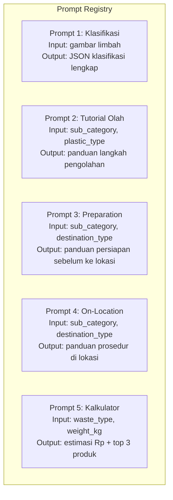

### 9.3 Skema Output Prompt Klasifikasi (Prompt 1)

Backend memerintahkan Gemini untuk merespons hanya dalam format JSON dengan struktur berikut:

```json
{
  "waste_name": "Botol Plastik PET 500ml",
  "category": "anorganik",
  "sub_category": "plastik",
  "plastic_type": "PET",
  "confidence_score": 0.94,
  "market_value_per_kg": {
    "min": 1500,
    "max": 3000,
    "currency": "IDR"
  },
  "demand_level": "tinggi",
  "available_paths": {
    "transform": true,
    "sell": true,
    "safe_disposal": false
  },
  "why_limited": null,
  "is_hazardous": false,
  "handling_note": null
}
```

### 9.4 Alur Panggilan AI

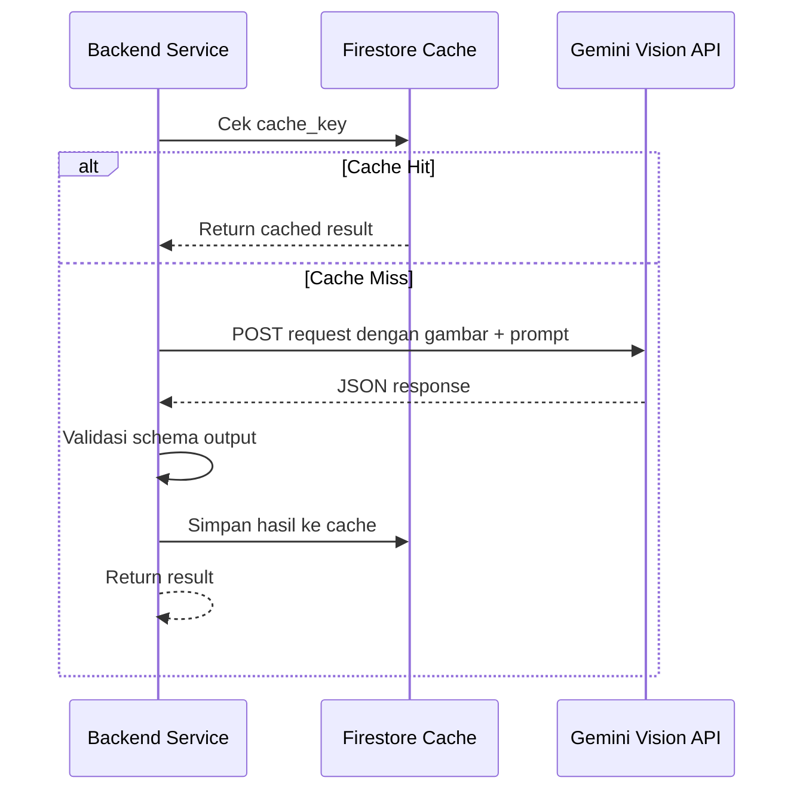

### 9.5 Penanganan Respons AI Tidak Valid

Jika Gemini mengembalikan respons yang tidak sesuai skema, sistem menjalankan retry logic:

1. Retry pertama: kirim ulang prompt dengan instruksi format yang lebih ketat
2. Retry kedua: sertakan contoh output yang diharapkan (few-shot)
3. Jika masih gagal: kembalikan error terstruktur ke client dengan pesan yang user-friendly

---

## 10. Infrastruktur Database & Storage

### 10.1 Firebase Firestore

Firestore digunakan sebagai database utama dengan model dokumen NoSQL. Setiap koleksi dirancang untuk mendukung query pola yang paling sering digunakan.

**Indeks yang Diperlukan:**

| Koleksi | Field 1 | Field 2 | Tipe Query |
|---|---|---|---|
| scans | user_id | created_at (desc) | Riwayat scan per user |
| events | user_id | event_type | Filter event per user |
| locations | type | accepted_waste_types | Filter lokasi per jenis limbah |
| tutorials | cache_key | — | Lookup cache tutorial |

### 10.2 Google Cloud Storage

Digunakan khusus untuk menyimpan gambar yang diupload pengguna.

| Parameter | Nilai |
|---|---|
| Bucket region | asia-southeast2 (Jakarta) |
| Storage class | Standard |
| Akses | Private (hanya backend yang punya akses via Service Account) |
| Penamaan file | `scans/{user_id}/{timestamp}_{random_hex}.{ext}` |
| Format yang diterima | JPEG, PNG, WebP |
| Ukuran maksimum | 5 MB per file |
| Lifecycle policy | Hapus otomatis setelah 90 hari |

### 10.3 Alur Upload Gambar

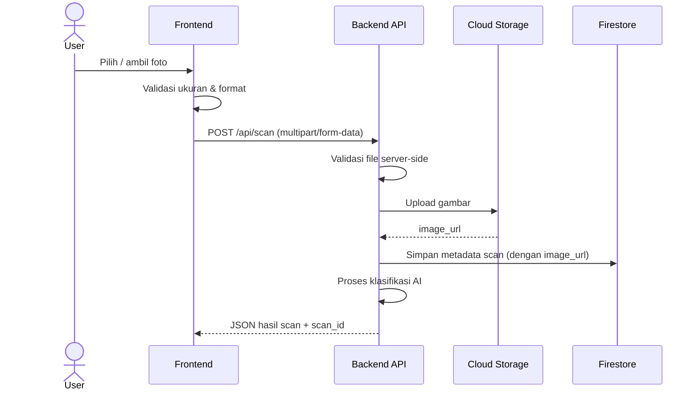

---

## 11. Infrastruktur Autentikasi

### 11.1 Firebase Authentication

Firebase Auth digunakan sebagai provider autentikasi utama dengan dua metode login.

### 11.2 Alur Autentikasi Lengkap

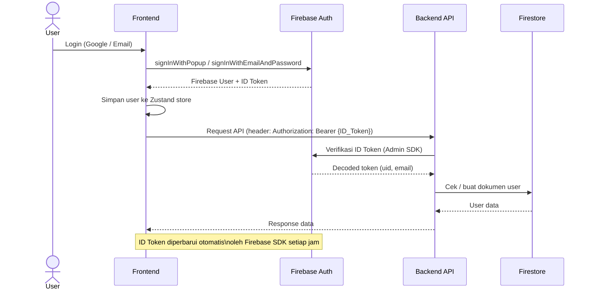

### 11.3 Validasi di Backend

Setiap endpoint yang membutuhkan autentikasi menjalankan middleware yang:
1. Membaca header `Authorization: Bearer {token}`
2. Memverifikasi token menggunakan Firebase Admin SDK
3. Menyisipkan `uid` dan `email` ke dalam request context
4. Mengembalikan HTTP 401 jika token tidak valid atau kadaluarsa

### 11.4 Guest Access

Pengguna yang belum login dapat melakukan scan maksimum 2 kali. Pembatasan diimplementasikan di frontend menggunakan `localStorage` untuk menyimpan jumlah scan yang sudah dilakukan dalam sesi tersebut.

---

## 12. Infrastruktur Maps

### 12.1 Google Maps Platform APIs yang Digunakan

| API | Penggunaan |
|---|---|
| Maps JavaScript API | Render peta interaktif di halaman Lokasi |
| Places API | Pencarian dan detail lokasi |
| Directions API | Kalkulasi rute ke lokasi tujuan |
| Geocoding API | Konversi koordinat ke nama lokasi (untuk menampilkan area terdekat) |

### 12.2 Implementasi Maps di Frontend

Maps JavaScript API diinisialisasi di sisi client dengan lazy loading — hanya dimuat ketika halaman Lokasi dibuka. API key Maps disimpan di environment variable frontend (public) karena memang dirancang untuk digunakan di browser, dengan pembatasan domain di konsol GCP.

### 12.3 Alur Fitur Lokasi

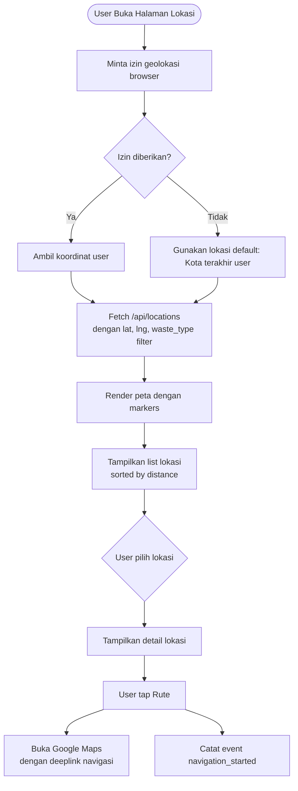

---

## 13. Arsitektur Deployment

### 13.1 Overview Infrastruktur

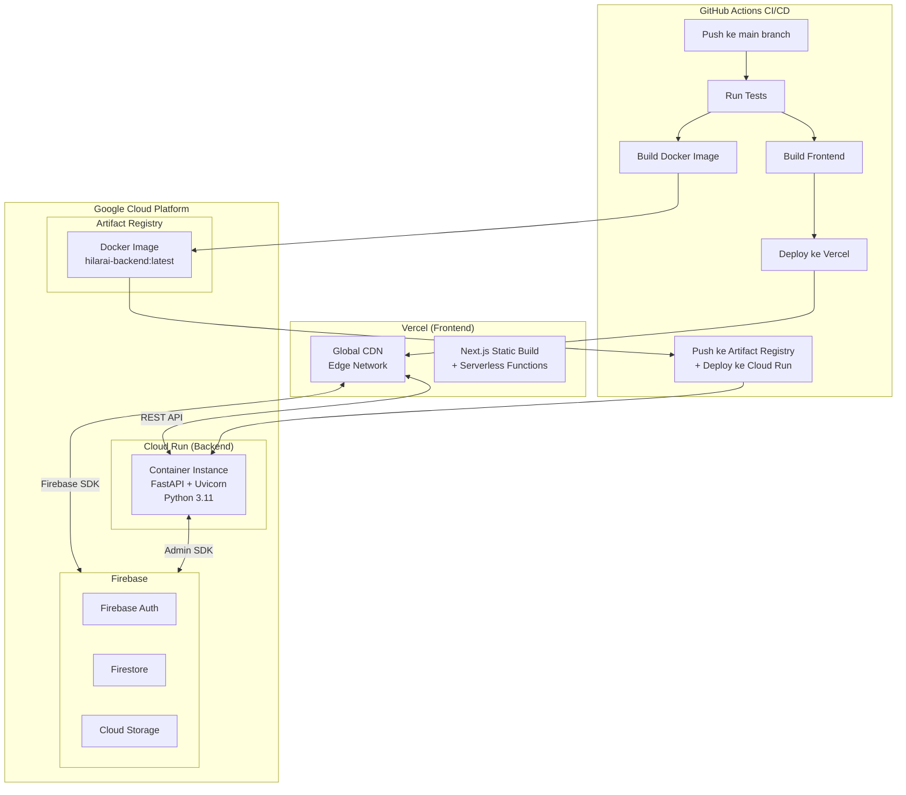

### 13.2 Konfigurasi Cloud Run

| Parameter | Nilai |
|---|---|
| Region | asia-southeast2 (Jakarta) |
| CPU | 1 vCPU |
| Memory | 512 MB |
| Min instances | 0 (scale to zero) |
| Max instances | 10 |
| Concurrency | 80 request per instance |
| Timeout | 60 detik |
| Port | 8080 |

### 13.3 Dockerfile Backend

```
Strategy: Multi-stage build
Stage 1 (builder): Install dependencies Python
Stage 2 (runtime): Copy hanya dependencies yang diperlukan
Base image: python:3.11-slim
Exposed port: 8080
Entry command: uvicorn app.main:app --host 0.0.0.0 --port 8080
```

### 13.4 Pipeline CI/CD

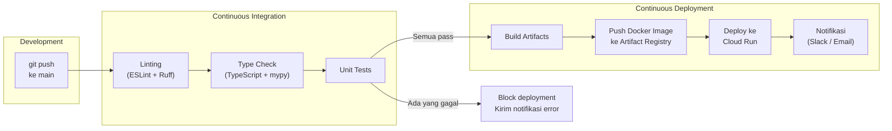

### 13.5 Environment Management

| Environment | Frontend | Backend | Keterangan |
|---|---|---|---|
| Development | localhost:3000 | localhost:8080 | Local development |
| Preview | Vercel preview URL | — | Per pull request, otomatis |
| Production | hilarai.vercel.app | Cloud Run URL | Deploy dari main branch |

---

## 14. Alur Kerja Aplikasi

### 14.1 Alur Scan Utama (Happy Path)

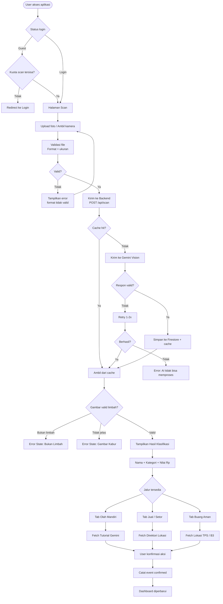

### 14.2 Alur Kalkulator Nilai

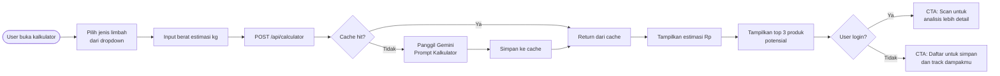

### 14.3 Alur Dashboard Analytics

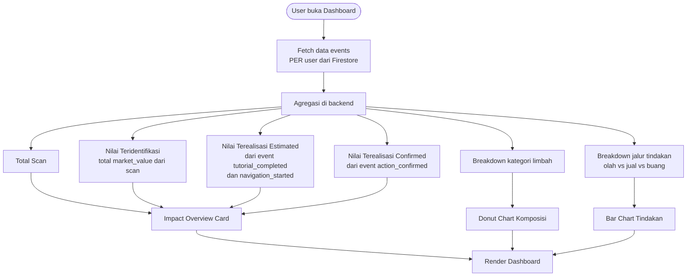

---

## 15. Spesifikasi API

### 15.1 Base URL

```
Production : https://api.hilarai.app/api/v1
Development: http://localhost:8080/api/v1
```

### 15.2 Autentikasi

Semua endpoint yang membutuhkan autentikasi menggunakan header:

```
Authorization: Bearer {Firebase_ID_Token}
```

Endpoint publik (tidak butuh token): `POST /calculator`, `GET /locations`

### 15.3 Endpoint Summary

| Method | Endpoint | Auth | Deskripsi |
|---|---|---|---|
| POST | /scan | Ya | Upload gambar dan dapatkan hasil klasifikasi |
| GET | /scan/{scan_id} | Ya | Ambil detail hasil scan berdasarkan ID |
| GET | /scan/history | Ya | Ambil riwayat scan pengguna |
| POST | /tutorial | Ya | Generate tutorial berdasarkan jenis limbah |
| GET | /locations | Tidak | Ambil daftar lokasi dengan filter |
| POST | /calculator | Tidak | Hitung estimasi nilai limbah |
| POST | /events | Ya | Catat event aktivitas pengguna |
| GET | /dashboard | Ya | Ambil data analytics pengguna |
| GET | /users/me | Ya | Ambil profil pengguna |
| PUT | /users/me | Ya | Perbarui profil pengguna |

### 15.4 Format Respons Standar

**Sukses:**
```json
{
  "status": "success",
  "data": { ... },
  "meta": {
    "cached": true,
    "request_id": "req_abc123"
  }
}
```

**Error:**
```json
{
  "status": "error",
  "error": {
    "code": "INVALID_IMAGE_FORMAT",
    "message": "Format gambar tidak didukung. Gunakan JPEG, PNG, atau WebP.",
    "details": null
  }
}
```

### 15.5 HTTP Status Code Convention

| Code | Makna | Digunakan untuk |
|---|---|---|
| 200 | OK | Request berhasil |
| 201 | Created | Resource baru berhasil dibuat |
| 400 | Bad Request | Validasi input gagal |
| 401 | Unauthorized | Token tidak ada atau tidak valid |
| 403 | Forbidden | Token valid tapi tidak punya akses |
| 404 | Not Found | Resource tidak ditemukan |
| 422 | Unprocessable Entity | Gambar tidak dapat diproses oleh AI |
| 429 | Too Many Requests | Rate limit terlampaui |
| 500 | Internal Server Error | Error tak terduga di server |

---

## 16. Strategi Keamanan

### 16.1 Keamanan API

- **API Key Gemini**: Disimpan hanya di backend sebagai environment variable. Tidak pernah dikirim ke client.
- **Firebase Admin Key**: Service account JSON di-encode base64 dan disimpan sebagai secret di Cloud Run.
- **CORS**: Hanya domain frontend yang terdaftar yang diizinkan mengirim request ke backend.
- **Rate Limiting**: Setiap IP dibatasi 60 request per menit untuk endpoint scan dan kalkulator.

### 16.2 Keamanan Upload Gambar

- Validasi MIME type dilakukan di sisi server (tidak hanya ekstensi file)
- Ukuran maksimum file divalidasi sebelum disimpan ke storage
- Nama file di-generate server-side (tidak menggunakan nama file dari client)
- Bucket Cloud Storage tidak dapat diakses publik — akses hanya melalui signed URL yang berlaku sementara

### 16.3 Keamanan Firestore

Firestore Security Rules dikonfigurasi sehingga:
- User hanya bisa baca/tulis dokumen miliknya sendiri
- Koleksi `locations` dapat dibaca publik
- Koleksi `tutorials` hanya dapat dibaca, tidak dapat dimodifikasi dari client
- Semua operasi tulis ke koleksi `events` dan `scans` hanya dari backend via Admin SDK

---

## 17. Penanganan Error

### 17.1 Klasifikasi Error

| Kategori | Contoh | Penanganan |
|---|---|---|
| Input Error | Format gambar salah, file terlalu besar | HTTP 400, pesan instruksi |
| Auth Error | Token kadaluarsa, tidak ada token | HTTP 401, redirect ke login |
| AI Processing Error | Gambar buram, bukan objek limbah | HTTP 422, tampilkan error state spesifik |
| External Service Error | Gemini timeout, Firestore tidak tersedia | HTTP 503, retry dengan backoff |
| Rate Limit Error | Terlalu banyak request | HTTP 429, tampilkan cooldown timer |

### 17.2 Error States di Frontend

| State | Kondisi Trigger | Tampilan |
|---|---|---|
| Gambar Tidak Jelas | confidence_score < 0.4 | Instruksi ambil ulang foto dengan cahaya lebih baik |
| Bukan Limbah | AI tidak mendeteksi objek limbah | Informasi bahwa objek bukan limbah + saran |
| B3 Terdeteksi | is_hazardous = true | Peringatan merah + jalur Buang Aman wajib |
| Jaringan Terputus | fetch error / timeout | Toast notification + tombol retry |
| Kuota Guest Habis | guest scan count >= 2 | Modal prompts untuk register |

---

## 18. Batasan & Risiko

### 18.1 Batasan Teknis

| Batasan | Dampak | Mitigasi |
|---|---|---|
| Gemini tidak selalu mengenali limbah lokal Indonesia | Hasil klasifikasi bisa kurang akurat | Sertakan konteks lokal di system prompt |
| Estimasi nilai tidak real-time | Data harga bisa tidak akurat | Tampilkan disclaimer bahwa harga bersifat indikatif |
| Data lokasi dikelola manual | Coverage terbatas di V1 | Seed data untuk kota-kota besar dulu |
| Scale to zero Cloud Run | Cold start 1-3 detik di request pertama | Tampilkan loading state yang informatif |

### 18.2 Risiko Proyek

| Risiko | Probabilitas | Dampak | Mitigasi |
|---|---|---|---|
| Kuota Gemini API habis | Sedang | Tinggi | Monitor penggunaan, aktifkan caching agresif |
| Perubahan pricing Google APIs | Rendah | Sedang | Batasi penggunaan Maps API dengan caching hasil |
| Data lokasi tidak akurat | Tinggi | Sedang | Verifikasi manual sebelum masuk database |
| Gambar limbah tidak teridentifikasi | Sedang | Sedang | Error state yang jelas + panduan ambil foto |

---

## 19. Glosarium

| Istilah | Definisi |
|---|---|
| Hilirisasi | Proses pengolahan bahan mentah atau limbah menjadi produk yang memiliki nilai tambah lebih tinggi |
| Cache Key | Kunci unik yang digunakan untuk menyimpan dan mengambil data dari cache |
| Confidence Score | Nilai keyakinan AI (0.0–1.0) terhadap hasil klasifikasi yang dihasilkan |
| Cold Start | Kondisi di mana container Cloud Run perlu diinisialisasi karena tidak ada instance yang aktif |
| Scale to Zero | Fitur Cloud Run yang mematikan semua instance saat tidak ada traffic untuk menghemat biaya |
| Event Level | Tingkatan konfirmasi aksi user: estimated (kemungkinan dilakukan) atau confirmed (sudah dipastikan) |
| Direktori Lokasi | Kumpulan data lokasi pengepul, Bank Sampah, TPS, dan drop point B3 yang dikurasi secara manual |
| Drop Point B3 | Lokasi resmi untuk menyerahkan limbah Bahan Berbahaya dan Beracun |
| Jalur Tindakan | Salah satu dari tiga opsi yang tersedia setelah scan: Olah Mandiri, Jual/Setor, atau Buang Aman |
| Guest Access | Mode penggunaan tanpa login dengan batas 2x scan per sesi |
